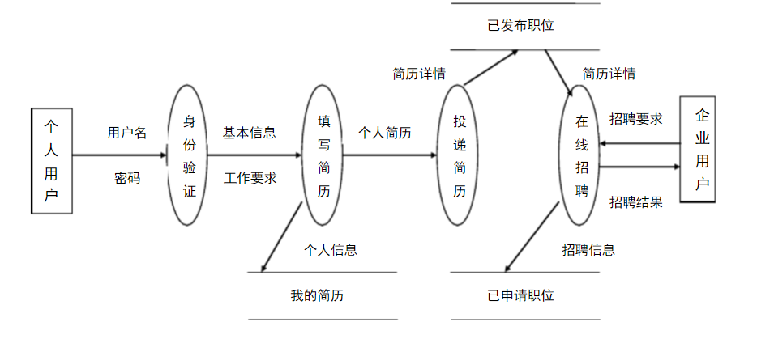

# Recruitment-website
####注：这是个简单的招聘网站,开发环境idea,tomcat8.0,jdk1.8

##后台
####这个网站的后台是使用了spring+mvc+hibernate框架，数据库使用的是mysql

##前台
####这个网站的前端页面使用了javascript+jquery+css等前端语言以及bootstrap框架以及datatbles+uploadjquery等插件

##这个网站的业务逻辑为：

